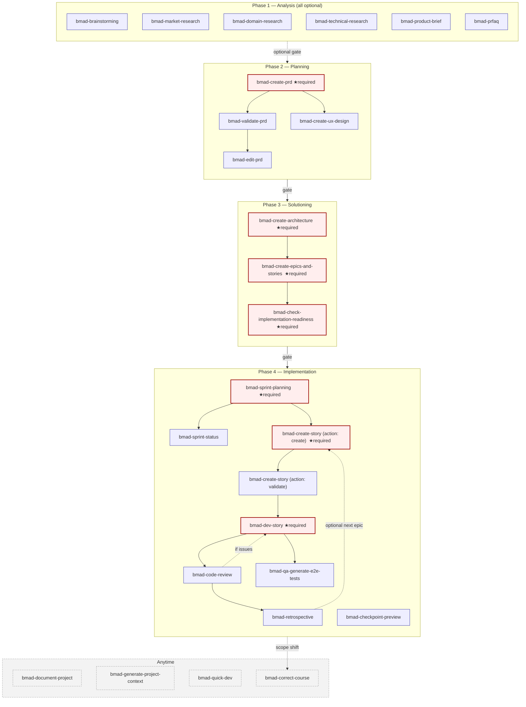

# Phase 0 — Engine Swap Inventory

> **Status:** Phase 0 deliverable. Read this end-to-end before reviewing the decisions log or starting Phase 1.
>
> **Operating contract:** [`ENGINE_SWAP_PROMPT.md`](../../../../ENGINE_SWAP_PROMPT.md) (committed to repo root)
> **Decision log:** [`DECISIONS.md`](./DECISIONS.md)
> **Branch:** `feature/bmad-engine-swap` (cut from `develop`)
> **Last revision:** 2026-04-30

This document is the canonical pre-migration snapshot. It records:

1. Which Aperant prompts, agent configs, and orchestration files are being deleted in Phase 5 (§1)
2. Which BMAD skills the new runtime depends on (§2)
3. The complete BMAD phase/dependency graph the orchestrator and Kanban will read from (§3, Mermaid diagram)
4. How the Aperant `AgentType` enum maps onto BMAD personas and workflows (§4)
5. Verification that the reference install at `~/Projects/BMAD-Install-Files/` matches a fresh `npx bmad-method install` (§5)
6. The Phase 0 BMAD documentation citations that ground these decisions (§6)
7. Open items for the human reviewer to confirm before Phase 1 starts (§7)

Every claim about BMAD behavior cites the live docs at `https://docs.bmad-method.org/llms-full.txt` per `<docs_protocol>` Rule 2.

---

## 1. Aperant assets being deleted (Phase 5 cleanup)

The engine-swap removes Aperant's bespoke spec/build/QA pipeline and replaces it with a generic BMAD workflow runtime (per `ENGINE_SWAP_PROMPT.md` §"What changes" + §"DELETE"). All deletions wait until Phase 5 so Phase 1–4 can land behind a draft PR without breaking existing builds.

### 1.1 Prompts (15 files in `apps/desktop/prompts/`)

| Path | Aperant role | BMAD replacement (target state) |
| --- | --- | --- |
| `apps/desktop/prompts/planner.md` | Drives the planning phase, produces `implementation_plan.json` with subtasks | `bmad-create-prd` (John) → `bmad-create-architecture` (Winston) → `bmad-create-epics-and-stories` (John) — see §3 graph |
| `apps/desktop/prompts/coder.md` | Implements one subtask at a time inside an isolated worktree | `bmad-dev-story` (Amelia) — story-cycle execution per BMAD docs § "Step 2: Build Your Project" |
| `apps/desktop/prompts/coder_recovery.md` | Recovery prompt when a coder run errors | `bmad-correct-course` (any persona) — surfaced as a "Course Correct" UI button per `ENGINE_SWAP_PROMPT.md` mapping table |
| `apps/desktop/prompts/qa_reviewer.md` | Validates implementation completeness before sign-off | `bmad-code-review` (Amelia) — built into the implementation cycle per `bmad-help.csv` `after`/`before` columns |
| `apps/desktop/prompts/qa_fixer.md` | Resolves QA-identified issues | Re-run of `bmad-dev-story` (Amelia) after `bmad-code-review` flags issues — same skill, fresh chat |
| `apps/desktop/prompts/qa_orchestrator_agentic.md` | Orchestrates multi-pass QA loop | Subsumed: BMAD's review/fix loop is encoded in `bmad-help.csv` (`bmad-code-review` returns control to `bmad-dev-story` if issues found) |
| `apps/desktop/prompts/spec_gatherer.md` | Asks user smart questions, writes `requirements.json` | `bmad-product-brief` (Mary) or `bmad-prfaq` (Mary) — track-dependent per BMAD docs § "Phase 1: Analysis" |
| `apps/desktop/prompts/spec_researcher.md` | Researches the problem domain | `bmad-domain-research` / `bmad-market-research` / `bmad-technical-research` (all Mary) |
| `apps/desktop/prompts/spec_writer.md` | Writes the spec markdown | `bmad-create-prd` (John) — Phase 2 Planning, required for BMad Method/Enterprise tracks |
| `apps/desktop/prompts/spec_critic.md` | Reviews the spec for gaps | `bmad-validate-prd` (John) — phase 2-planning, after `bmad-create-prd` |
| `apps/desktop/prompts/spec_orchestrator_agentic.md` | Drives the spec creation pipeline | Replaced by `BmadOrchestrator` (KAD-4 + KAD-9) — phase progression reads from `bmad-help.csv` graph |
| `apps/desktop/prompts/spec_quick.md` | Lightweight spec for trivial tasks | `bmad-quick-dev` (Amelia) — Quick Flow track per BMAD docs § "Three Planning Tracks" |
| `apps/desktop/prompts/complexity_assessor.md` | Picks pipeline track based on task complexity | UI radio button on project creation (BMad Method / Quick Flow / Enterprise) — no prose prompt; per `ENGINE_SWAP_PROMPT.md` mapping table |
| `apps/desktop/prompts/followup_planner.md` | Plans follow-up work after a build | `bmad-correct-course` (any persona) or `bmad-retrospective` (Amelia) — both already in the BMAD catalog |
| `apps/desktop/prompts/validation_fixer.md` | Re-runs validation after a fix | Same as `qa_fixer` — folded into the `bmad-code-review` ↔ `bmad-dev-story` loop |

**KEEP** (these prompts power Aperant features that BMAD does not provide; per KAD-10):

- `roadmap_features.md`, `roadmap_discovery.md`
- `insight_extractor.md`
- `ideation_ui_ux.md`, `ideation_security.md`, `ideation_performance.md`, `ideation_documentation.md`, `ideation_code_quality.md`, `ideation_code_improvements.md`
- `competitor_analysis.md`

### 1.2 Orchestration TypeScript files (`apps/desktop/src/main/ai/orchestration/`)

| Path | Function | Replaced by |
| --- | --- | --- |
| `build-orchestrator.ts` | Drives `planner → coder → qa_reviewer → qa_fixer` phase loop | `apps/desktop/src/main/ai/bmad/orchestrator.ts` (4-phase BMAD lifecycle from `bmad-help.csv`) |
| `spec-orchestrator.ts` | Drives `spec_gatherer → spec_researcher → spec_writer → spec_critic` | Same as above + `apps/desktop/src/main/ai/bmad/help-runner.ts` (recommends next required action) |
| `qa-loop.ts` | QA pass/fail loop | Encoded in `bmad-help.csv` (`bmad-code-review` re-routes to `bmad-dev-story` if issues found) |
| `recovery-manager.ts` | Detects stuck builds, offers recovery | `bmad-correct-course` skill surfaced as a "Course Correct" button |
| `subtask-iterator.ts` | Iterates pre-planned subtasks | `bmad-sprint-status` + `sprint-status.yaml` driver — story status states are the new iteration unit (KAD-8) |
| `parallel-executor.ts` | Subagent fan-out for parallel execution | **Removed** — does not fit BMAD's interactive, just-in-time-step-load model (per `ENGINE_SWAP_PROMPT.md` DELETE list comment) |
| `qa-reports.ts` | QA report generation | Subsumed by `bmad-code-review` outputs in `_bmad-output/implementation-artifacts/` |
| `subagent-executor.ts` | Spawns and supervises subagent runs | **Removed** — same rationale as `parallel-executor.ts` |
| `pause-handler.ts` | Rate-limit / auth pause sentinel files (`RATE_LIMIT_PAUSE`, `AUTH_PAUSE`, `RESUME`) | **Open question — see §7.** Currently only consumed by `subtask-iterator.ts`; orphaned once that file is deleted. Recommend deleting unless a pause/resume IPC is reused by the new `WorkflowRunner`. |

### 1.3 Spec module (`apps/desktop/src/main/ai/spec/` — entire directory)

| Path | Function |
| --- | --- |
| `spec-validator.ts` | Validates Aperant spec files against schemas |
| `conversation-compactor.ts` | Compacts long agent conversations to fit context |

Both deleted with the directory per `ENGINE_SWAP_PROMPT.md` DELETE list. BMAD does not have a parallel concept — workflows are stateless across runs (KAD-7) and validation is per-skill.

### 1.4 Agent type registry

`apps/desktop/src/main/ai/config/agent-configs.ts` exports an `AgentType` union with **32 types**. Phase 5 removes the build/spec/QA-related entries (14 of 32) and keeps the rest (Aperant features that BMAD does not replicate — per KAD-10). The mapping is in §4.

The 14 entries to remove:
`spec_gatherer`, `spec_researcher`, `spec_writer`, `spec_critic`, `spec_discovery`, `spec_context`, `spec_validation`, `spec_compaction`, `spec_orchestrator`, `build_orchestrator`, `planner`, `coder`, `qa_reviewer`, `qa_fixer`.

The 18 entries to keep (Aperant value-adds):
`insights`, `merge_resolver`, `commit_message`, `pr_template_filler`, `pr_reviewer`, `pr_orchestrator_parallel`, `pr_followup_parallel`, `pr_followup_extraction`, `pr_finding_validator`, `pr_security_specialist`, `pr_quality_specialist`, `pr_logic_specialist`, `pr_codebase_fit_specialist`, `analysis`, `batch_analysis`, `batch_validation`, `roadmap_discovery`, `competitor_analysis`, `ideation`. (19 — the count includes `analysis` which the team can confirm in Phase 5.)

### 1.5 Existing Aperant spec data (`.auto-claude/specs/`)

`.auto-claude/specs/` is **empty** in this checkout (no `001-*` directories present). Migration scope on this repo: **zero specs to migrate**.

The migrator (`apps/desktop/src/main/ai/bmad/migrator.ts`, Phase 5) still ships because installed copies of BMad Studio in the wild may have populated `.auto-claude/specs/` directories.

---

## 2. BMAD skills depended on

Source of truth: `~/Projects/BMAD-Install-Files/_bmad/_config/skill-manifest.csv` (43 rows including header → **42 skills**). Counts match the installer's `cursor configured: 42 skills → .agents/skills` log line from a fresh `npx bmad-method install --yes --modules bmm --tools cursor`.

Per BMAD docs § "Skill Categories", skills split into three kinds: **Agent skills** (load a persona), **Workflow skills** (run a multi-step process), **Task / Tool skills** (standalone operations).

### 2.1 Core module (12 skills, always installed)

Per BMAD docs § "Core Tools" — these are available regardless of which optional modules are installed.

| canonicalId | Type | Path |
| --- | --- | --- |
| `bmad-help` | Task | `_bmad/core/bmad-help/SKILL.md` |
| `bmad-brainstorming` | Workflow | `_bmad/core/bmad-brainstorming/SKILL.md` |
| `bmad-party-mode` | Workflow | `_bmad/core/bmad-party-mode/SKILL.md` |
| `bmad-customize` | Task | `_bmad/core/bmad-customize/SKILL.md` |
| `bmad-distillator` | Task | `_bmad/core/bmad-distillator/SKILL.md` |
| `bmad-advanced-elicitation` | Task | `_bmad/core/bmad-advanced-elicitation/SKILL.md` |
| `bmad-review-adversarial-general` | Task | `_bmad/core/bmad-review-adversarial-general/SKILL.md` |
| `bmad-review-edge-case-hunter` | Task | `_bmad/core/bmad-review-edge-case-hunter/SKILL.md` |
| `bmad-editorial-review-prose` | Task | `_bmad/core/bmad-editorial-review-prose/SKILL.md` |
| `bmad-editorial-review-structure` | Task | `_bmad/core/bmad-editorial-review-structure/SKILL.md` |
| `bmad-shard-doc` | Task | `_bmad/core/bmad-shard-doc/SKILL.md` |
| `bmad-index-docs` | Task | `_bmad/core/bmad-index-docs/SKILL.md` |

### 2.2 BMM module — Phase 1 Analysis (8 skills)

| canonicalId | Type | Path |
| --- | --- | --- |
| `bmad-agent-analyst` | Agent (Mary, 📊) | `_bmad/bmm/1-analysis/bmad-agent-analyst/SKILL.md` |
| `bmad-agent-tech-writer` | Agent (Paige, 📚) | `_bmad/bmm/1-analysis/bmad-agent-tech-writer/SKILL.md` |
| `bmad-document-project` | Workflow | `_bmad/bmm/1-analysis/bmad-document-project/SKILL.md` |
| `bmad-prfaq` | Workflow | `_bmad/bmm/1-analysis/bmad-prfaq/SKILL.md` |
| `bmad-product-brief` | Workflow | `_bmad/bmm/1-analysis/bmad-product-brief/SKILL.md` |
| `bmad-domain-research` | Workflow | `_bmad/bmm/1-analysis/research/bmad-domain-research/SKILL.md` |
| `bmad-market-research` | Workflow | `_bmad/bmm/1-analysis/research/bmad-market-research/SKILL.md` |
| `bmad-technical-research` | Workflow | `_bmad/bmm/1-analysis/research/bmad-technical-research/SKILL.md` |

### 2.3 BMM module — Phase 2 Planning (6 skills)

| canonicalId | Type | Path |
| --- | --- | --- |
| `bmad-agent-pm` | Agent (John, 📋) | `_bmad/bmm/2-plan-workflows/bmad-agent-pm/SKILL.md` |
| `bmad-agent-ux-designer` | Agent (Sally, 🎨) | `_bmad/bmm/2-plan-workflows/bmad-agent-ux-designer/SKILL.md` |
| `bmad-create-prd` | Workflow | `_bmad/bmm/2-plan-workflows/bmad-create-prd/SKILL.md` |
| `bmad-validate-prd` | Workflow | `_bmad/bmm/2-plan-workflows/bmad-validate-prd/SKILL.md` |
| `bmad-edit-prd` | Workflow | `_bmad/bmm/2-plan-workflows/bmad-edit-prd/SKILL.md` |
| `bmad-create-ux-design` | Workflow | `_bmad/bmm/2-plan-workflows/bmad-create-ux-design/SKILL.md` |

### 2.4 BMM module — Phase 3 Solutioning (5 skills)

| canonicalId | Type | Path |
| --- | --- | --- |
| `bmad-agent-architect` | Agent (Winston, 🏗️) | `_bmad/bmm/3-solutioning/bmad-agent-architect/SKILL.md` |
| `bmad-create-architecture` | Workflow | `_bmad/bmm/3-solutioning/bmad-create-architecture/SKILL.md` |
| `bmad-create-epics-and-stories` | Workflow | `_bmad/bmm/3-solutioning/bmad-create-epics-and-stories/SKILL.md` |
| `bmad-check-implementation-readiness` | Workflow | `_bmad/bmm/3-solutioning/bmad-check-implementation-readiness/SKILL.md` |
| `bmad-generate-project-context` | Workflow | `_bmad/bmm/3-solutioning/bmad-generate-project-context/SKILL.md` |

### 2.5 BMM module — Phase 4 Implementation (11 skills)

| canonicalId | Type | Path |
| --- | --- | --- |
| `bmad-agent-dev` | Agent (Amelia, 💻) | `_bmad/bmm/4-implementation/bmad-agent-dev/SKILL.md` |
| `bmad-sprint-planning` | Workflow | `_bmad/bmm/4-implementation/bmad-sprint-planning/SKILL.md` |
| `bmad-sprint-status` | Workflow | `_bmad/bmm/4-implementation/bmad-sprint-status/SKILL.md` |
| `bmad-create-story` | Workflow | `_bmad/bmm/4-implementation/bmad-create-story/SKILL.md` |
| `bmad-dev-story` | Workflow | `_bmad/bmm/4-implementation/bmad-dev-story/SKILL.md` |
| `bmad-code-review` | Workflow | `_bmad/bmm/4-implementation/bmad-code-review/SKILL.md` |
| `bmad-checkpoint-preview` | Workflow | `_bmad/bmm/4-implementation/bmad-checkpoint-preview/SKILL.md` |
| `bmad-qa-generate-e2e-tests` | Workflow | `_bmad/bmm/4-implementation/bmad-qa-generate-e2e-tests/SKILL.md` |
| `bmad-quick-dev` | Workflow | `_bmad/bmm/4-implementation/bmad-quick-dev/SKILL.md` |
| `bmad-correct-course` | Workflow | `_bmad/bmm/4-implementation/bmad-correct-course/SKILL.md` |
| `bmad-retrospective` | Workflow | `_bmad/bmm/4-implementation/bmad-retrospective/SKILL.md` |

**Per BMAD docs § "What Named Agents Buy You":** the six personas (Mary/Paige/John/Sally/Winston/Amelia) have hardcoded identity (`agent.name`, `agent.title`) and a customizable layer (icon, role, principles, communication style, menu). Persona persistence semantics codified in `ENGINE_SWAP_PROMPT.md` KAD-7.

---

## 3. BMAD phase / dependency graph

Source of truth: `~/Projects/BMAD-Install-Files/_bmad/_config/bmad-help.csv` (the canonical phase-graph database per `ENGINE_SWAP_PROMPT.md` KAD-3). The Mermaid diagram below renders every BMM-module workflow's phase, required-vs-optional status, and `after`/`before` dependencies. Phase nodes match BMAD docs § "Understanding BMad" — Analysis / Planning / Solutioning / Implementation. The "anytime" phase is rendered as a separate sidebar.

The orchestrator's `getRequiredWorkflowsForPhase(phase, track)` (Phase 1 deliverable) and the Kanban's column transitions (Phase 3) read directly from this graph.



**Reading guide for the orchestrator:**

- A phase is "complete" when every workflow with `required=true` for that phase has produced its declared output (`output-location` + `outputs` columns of `bmad-help.csv`).
- The Kanban's "Run" affordance on a story card calls `getNextWorkflow(story.status)` against this graph.
- Optional Analysis-phase workflows do **not** block Phase 2 entry — the user can start with `bmad-create-prd` directly.
- The story cycle (`CSc → CSv → DS → CR`) loops per story; `CR` re-routing to `DS` on issues is an implicit dependency the orchestrator must surface as "Run code review" then optionally "Re-run dev-story."

**Per BMAD docs § "The Activation Flow":** every workflow / agent runs through an 8-step activation sequence (resolve customize.toml → execute prepend → adopt persona → load persistent_facts → load config → greet → execute append → dispatch). The runtime port (`workflow-runner.ts`) replicates this verbatim per Phase 2 deliverables.

---

## 4. AgentType → BMAD persona+workflow mapping

Aperant's old runtime had **one giant `AgentType` enum** that bundled prompt, model, MCP servers, and tools. BMAD splits this into **personas** (6 hardcoded names from `bmad-agent-*` skills) × **workflows** (any installed skill). The runtime is generic per `ENGINE_SWAP_PROMPT.md` KAD-4: the persona system prompt + workflow body fully describes behavior; no enum entry is needed for individual workflows.

Per BMAD docs § "What Named Agents Buy You", the persona name + title are read-only identity — overrides cannot rename Mary or change her title. They can change everything else (icon, role, principles, communication style, menu items).

### 4.1 Aperant types being deleted → BMAD replacement

| Aperant `AgentType` | BMAD persona | BMAD workflow(s) | Phase | Track applicability |
| --- | --- | --- | --- | --- |
| `spec_gatherer` | Mary (📊) | `bmad-product-brief` (default) or `bmad-prfaq` (Working Backwards challenge) | 1-analysis | All — but optional in Quick Flow |
| `spec_researcher` | Mary (📊) | `bmad-domain-research`, `bmad-market-research`, `bmad-technical-research` (composite — runtime picks per user choice) | 1-analysis | Optional everywhere |
| `spec_writer` | John (📋) | `bmad-create-prd` | 2-planning | Required for BMad Method / Enterprise; replaced by `bmad-quick-dev` in Quick Flow |
| `spec_critic` | John (📋) | `bmad-validate-prd` | 2-planning | Optional gate after `bmad-create-prd` |
| `spec_discovery` | Mary (📊) | `bmad-document-project` (brownfield context) | anytime | Used during onboarding to existing repos |
| `spec_context` | Winston (🏗️) | `bmad-generate-project-context` | 3-solutioning (also anytime) | Required for brownfield; recommended for greenfield |
| `spec_validation` | John (📋) | `bmad-validate-prd` | 2-planning | Same as `spec_critic` — collapses |
| `spec_compaction` | — | **Deleted** — BMAD's persona-persists-but-conversation-resets model (KAD-7) eliminates the need for compaction; fresh chat per workflow |
| `spec_orchestrator` | — | **Deleted** — `BmadOrchestrator` (Phase 2 deliverable) drives phase progression from `bmad-help.csv` graph; no per-pipeline orchestrator agent |
| `build_orchestrator` | — | **Deleted** — same as above |
| `planner` | John (📋) | `bmad-create-epics-and-stories` (the architectural-aware planner) | 3-solutioning | Required for BMad Method / Enterprise |
| `coder` | Amelia (💻) | `bmad-dev-story` (story execution) or `bmad-quick-dev` (Quick Flow track) | 4-implementation | Required |
| `qa_reviewer` | Amelia (💻) | `bmad-code-review` | 4-implementation | Recommended; auto-invoked after `bmad-dev-story` per BMAD docs § "Step 2: Build Your Project" |
| `qa_fixer` | Amelia (💻) | Re-run of `bmad-dev-story` after `bmad-code-review` flags issues | 4-implementation | Implicit — not a separate workflow |

### 4.2 Aperant types being kept (KAD-10)

These power features BMAD does not replicate (insights, PR review, ideation, roadmap, merge resolution). They keep their existing `AgentType` entries and prompt files unchanged:

`insights`, `merge_resolver`, `commit_message`, `pr_template_filler`, `pr_reviewer`, `pr_orchestrator_parallel`, `pr_followup_parallel`, `pr_followup_extraction`, `pr_finding_validator`, `pr_security_specialist`, `pr_quality_specialist`, `pr_logic_specialist`, `pr_codebase_fit_specialist`, `analysis`, `batch_analysis`, `batch_validation`, `roadmap_discovery`, `competitor_analysis`, `ideation`.

### 4.3 Persona registry (post-migration)

Hardcoded TS literal union per `ENGINE_SWAP_PROMPT.md` mapping table (line 68):

```ts
type BmadPersona = 'mary' | 'paige' | 'john' | 'sally' | 'winston' | 'amelia';
```

| Slug | Name | Title | Icon | Module | Phase anchor |
| --- | --- | --- | --- | --- | --- |
| `mary` | Mary | Business Analyst | 📊 | bmm | 1-analysis |
| `paige` | Paige | Technical Writer | 📚 | bmm | 1-analysis |
| `john` | John | Product Manager | 📋 | bmm | 2-planning |
| `sally` | Sally | UX Designer | 🎨 | bmm | 2-planning |
| `winston` | Winston | System Architect | 🏗️ | bmm | 3-solutioning |
| `amelia` | Amelia | Senior Software Engineer | 💻 | bmm | 4-implementation |

Source: `~/Projects/BMAD-Install-Files/_bmad/config.toml` (`[agents.bmad-agent-*]` blocks). Persona-to-workflow ownership matches BMAD docs § "Default Agents" trigger codes.

---

## 5. Reference install verification

**Verification method:** ran `npx bmad-method install --yes --modules bmm --tools cursor --directory /tmp/bmad-fresh-install` against an empty directory, then `diff -rq ~/Projects/BMAD-Install-Files/ /tmp/bmad-fresh-install/`.

**Result:** five files differ — all install-time-generated metadata. Every skill file (`SKILL.md`, step files, `customize.toml`, templates) is byte-identical. The reference install is faithful.

| Differing file | Why it differs (expected) |
| --- | --- |
| `_bmad/_config/manifest.yaml` | Reference install was made on the `@next` channel (v6.6.1-next.0); fresh install is on the default channel (v6.6.0). Also includes per-install timestamps. |
| `_bmad/_config/files-manifest.csv` | Hashes of installer-generated config files differ because of project-name embedding (see below). |
| `_bmad/config.toml` | Embeds `project_name = "BMAD-Install-Files"` vs `project_name = "bmad-fresh-install"`. |
| `_bmad/bmm/config.yaml` | Same — module config embeds resolved paths under `_bmad-output/`. |
| `_bmad/core/config.yaml` | Same — core config embeds resolved paths. |

**Implication for the runtime port:**

- The skill content under `.agents/skills/` and `_bmad/{module}/{skill}/` is the immutable spec.
- The five files above are install outputs, not runtime contracts. The TS resolver (Phase 1 deliverable) reads from `_bmad/config.toml` + `_bmad/custom/config.toml` + `_bmad/custom/config.user.toml` per BMAD docs § "Central Configuration" — variation across installs is expected and merge rules are stable.
- The version skew (`@next` vs default channel) is a **reminder** that the reference install at `~/Projects/BMAD-Install-Files/` is a snapshot, not the spec. Per `<docs_protocol>` Rule 3, when the snapshot and live docs disagree, follow the docs and log it.

**Logged in DECISIONS.md as D-001.** No further action needed in Phase 0.

---

## 6. Phase 0 documentation citations

Per `ENGINE_SWAP_PROMPT.md` Phase 0 pre-work and the `<bmad_docs_index>` Phase 0 section, the live docs at `https://docs.bmad-method.org/llms-full.txt` were fetched on 2026-04-30 (snapshot at `agent-tools/725c94af-eee0-4f55-a863-0c37180edeee.txt`, 169.7 KB, 3576 lines, generated 2026-04-29).

Sections read and cited above:

| Doc section | Why it grounds Phase 0 | Inventory § citing it |
| --- | --- | --- |
| § "Understanding BMad" | The 4-phase mental model (Analysis/Planning/Solutioning/Implementation) and the three planning tracks (Quick/Method/Enterprise) | §3 phase graph; §4 mapping table |
| § "Quick Reference" | Canonical workflow catalog used to validate skill manifest enumeration | §2 (skill counts cross-checked) |
| § "Skill Categories" | Three skill kinds — Agent / Workflow / Task & Tool | §2 (Type column in each table) |
| § "The Three-Legged Stool" (within § "Customization as a First-Class Citizen") | Skills + named agents + customization triad — informs persona/workflow split in §4 | §4.3 persona registry rationale |
| § "What Named Agents Buy You" | Why personas have read-only identity and customizable surface | §4.3 + KAD-7 reference |
| § "The Activation Flow" | 8-step sequence the runtime port must mirror | §3 reading guide (referenced for Phase 2 plan) |
| § "Default Agents" | Authoritative persona-to-workflow ownership | §4 mapping table |

Cross-cutting cite (read once, refer often per `<bmad_docs_index>`): § "Key Takeaways" — non-negotiables: fresh chats, track choice, BMad-Help auto-runs at workflow end. Codified in KAD-7 + KAD-3.

Live URL for the section anchors: `https://docs.bmad-method.org/llms-full.txt` (the doc index doesn't expose per-section permalinks but section titles are stable across releases per `<docs_protocol>` Rule 1).

---

## 7. Open questions for the human reviewer

These are decisions that aren't blocking but should be confirmed before Phase 1 kicks off so they don't surface as ambiguity mid-build.

1. **`pause-handler.ts` disposition.** Currently only consumed by `subtask-iterator.ts` (which is in the DELETE list). After that file is deleted, `pause-handler.ts` is a 247-line orphan. Recommend deleting it in Phase 5 alongside the other orchestration files. Confirm or flag a reuse case (e.g., does the new `WorkflowRunner` need pause/resume sentinels for rate-limit pausing?). Logged as D-002.

2. **`AgentType` enum entry `analysis`.** Used for ad-hoc analysis runs but the consumer surface is unclear. Confirm whether to keep, rename, or fold into `ideation`. Listed under KEEP in §1.4 by default. Logged as D-003.

3. **`spec_compaction` deletion is safe.** BMAD's "fresh chat per workflow" model (KAD-7 + BMAD docs § "Step 1: Create Your Plan" caution box) means we never accumulate enough conversation to require compaction. Verifying nothing else in the codebase references `spec_compaction` outside the spec/ pipeline would be valuable. Logged as D-004.

4. **Quick Flow track wiring.** The mapping table picks `bmad-quick-dev` (Amelia, anytime phase) as the Quick Flow replacement for `spec_writer + planner + coder`. The `bmad-quick-dev` skill internally clarifies → plans → implements → reviews → presents per its `SKILL.md` description. Confirm this is the expected user experience for "I just want to fix a bug" — alternative: keep BMad Method as the only track in Phase 1–4 and ship Quick Flow in Phase 5. Logged as D-005.

5. **Migration backup path.** The Phase 5 migrator (`migrator.ts`) backs up to `.auto-claude.backup/`. Since `.auto-claude/specs/` is empty in this checkout, this only matters for installed copies in the wild. Confirm we're OK shipping the migrator without a corresponding test fixture in this repo. Logged as D-006.

6. **GitHub issue title.** `ENGINE_SWAP_PROMPT.md` Phase 0 deliverable 4 says open an issue titled "Engine swap: Aperant → BMad Method frontend." I'll open this against `BMAD-Studio` after you sign off on §1–§5. Confirm the repository name (`BMAD-Studio` vs the older `auto-claude` name visible in some configs).

---

## Summary

- **Branch cut:** `feature/bmad-engine-swap` from `develop`. Local only — not pushed yet.
- **Aperant deletions enumerated:** 15 prompts, 9 orchestration files (1 orphan flagged), 2 spec/ files, 14 of 32 `AgentType` entries.
- **BMAD dependencies enumerated:** 42 skills (12 core + 30 BMM), grouped by phase and skill kind.
- **Phase graph:** rendered as a Mermaid diagram in §3, sourced verbatim from `bmad-help.csv`.
- **Persona registry:** 6 personas with hardcoded identity + customizable surface, sourced from `_bmad/config.toml`.
- **Mapping table:** every deleted Aperant `AgentType` paired with its BMAD persona + workflow successor.
- **Install verification:** reference install at `~/Projects/BMAD-Install-Files/` is faithful — only install-time metadata differs.
- **Open questions:** 6 items (D-002 through D-006) for human review; none are blockers for starting Phase 1.

**Status:** Phase 0 inventory complete. Awaiting human review of this file + `DECISIONS.md` per `ENGINE_SWAP_PROMPT.md` Phase 0 gate.
